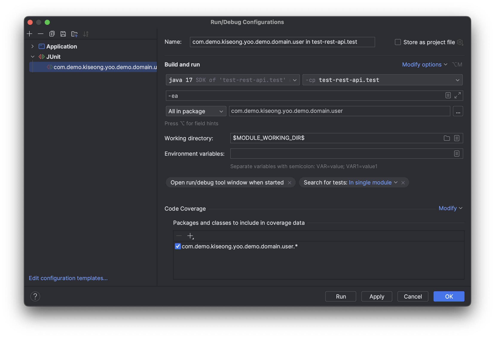

# Test Rest API

Application with Spring Framework and Spring Boot

# API Documentation

go to `http://localhost:${server.port}/swagger-ui/index.html` after starting application

# API Test Helper

download the file in the link below and import it in **postman**

[test-rest-api postman collection](./postman/test-rest-api.postman_collection.json)

location: `./postman/test-rest-api.postman_collection.json`

# Application Setup

## Run Docker Compose

Spring Data JPA instance in the current application connects to MySQL

Test Codes in the current project are all integration tests using real computing resources(e.g. database)

so you should start docker compose containers first

### step 1

setup environment variables for docker containers including MySQL

copy file `docker/example.env` and rename to `.env`

fill the values in the dotenv

### step 2

now run the command at the project root

if you are at a different location than project root, you should edit the path to compose file(docker-compose.yaml)

> ```bash
> $ docker compose -f docker/docker-compose.yaml up -d
>```

## Setup Environment Variables

the main application and the test codes that this project provides require for the user to set several environment variables before executing run command

### step 1

copy file `src/main/resource/example.env` and rename to .env.${current_environment}

you can select one of these as the file name: `.env.production`, `.env.development`, `.env.test`, etc. whatever you want

if you put semi colon at the end of every line, it will becomes much easier when you set multiple environment variable
at once by copy-paste.

### step 2

you should set particular environment variables which are used in application.yaml

if you are running your application through IntelliJ IDE, you should put the contents of .env* in the section named "
Environment Variables" in the photo below



if you are running your application through CLI such as interactive terminal, you should put the contents of .env* on the cursor and press enter

## Now Run

if you diligently followed the instructions above you are ready to execute run command

now run the application or run tests

you will see all works properly
